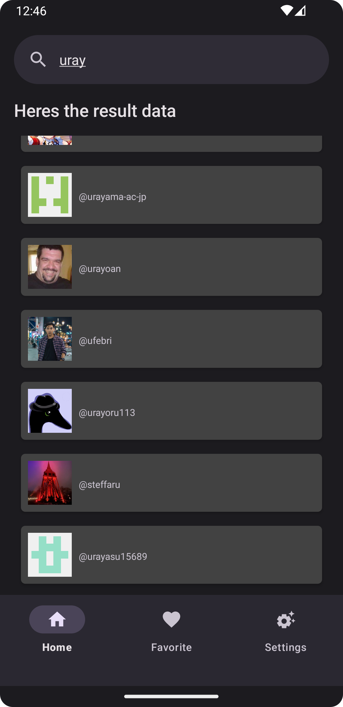
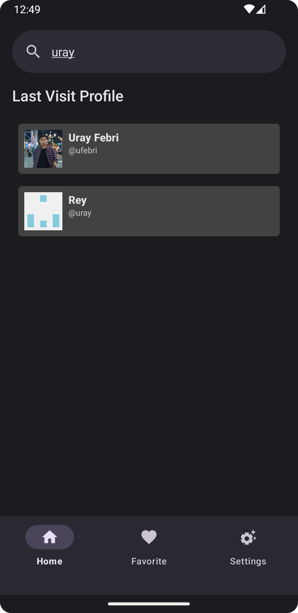
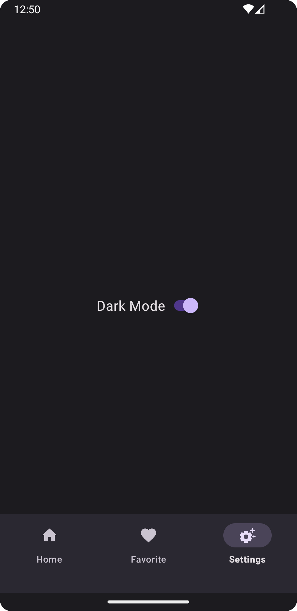

GitRay
======
An Android Application to looking someone GitHub Profile.

Library
-------

- [SplashScreen API](https://developer.android.com/develop/ui/views/launch/splash-screen/migrate)
- Room
- Hilt
- Paging 3
- Retrofit
- Lottie

FAQ
===

- 

How this our CI/CD Work?

[Credit for TharunBalaji2004](https://github.com/TharunBalaji2004/android-ci-cd)
   

Credit
======

- [Material Theme Builder](https://m3.material.io/theme-builder)
- [Icon.kitchen](https://icon.kitchen)